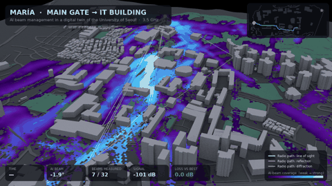
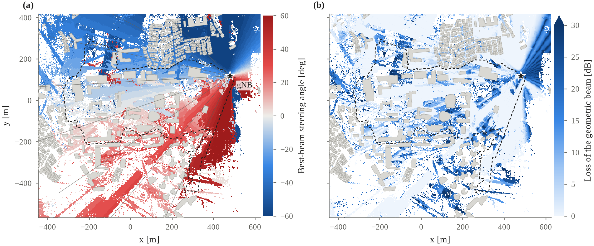
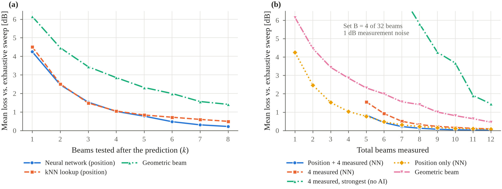
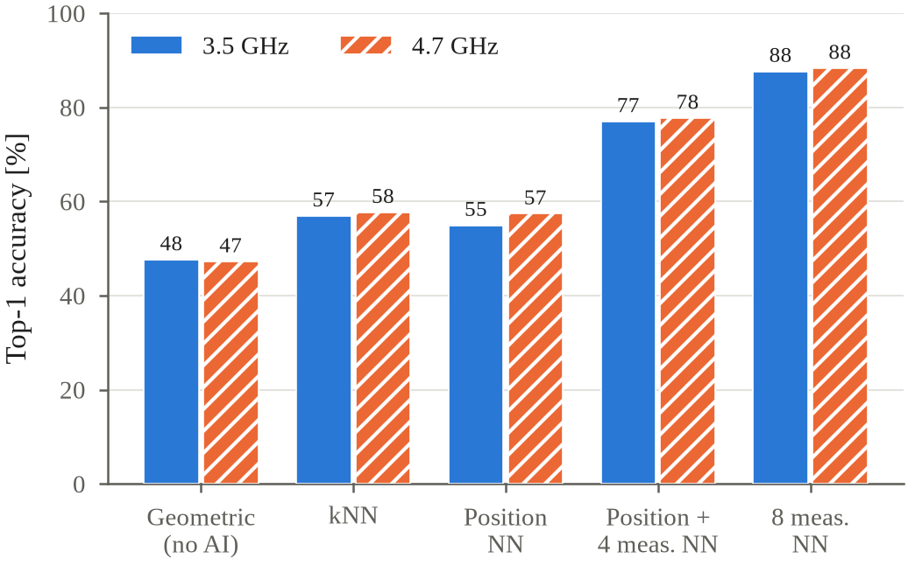
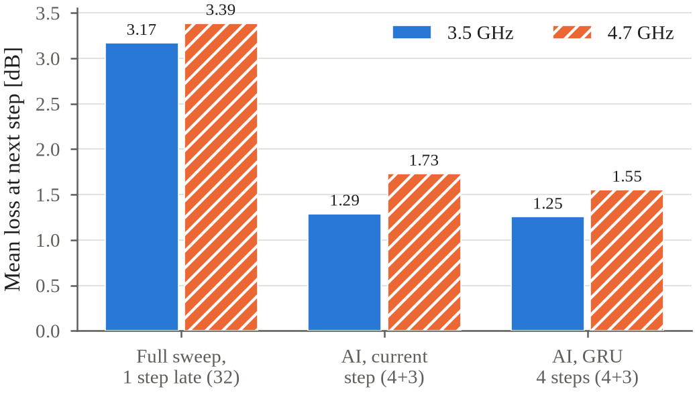
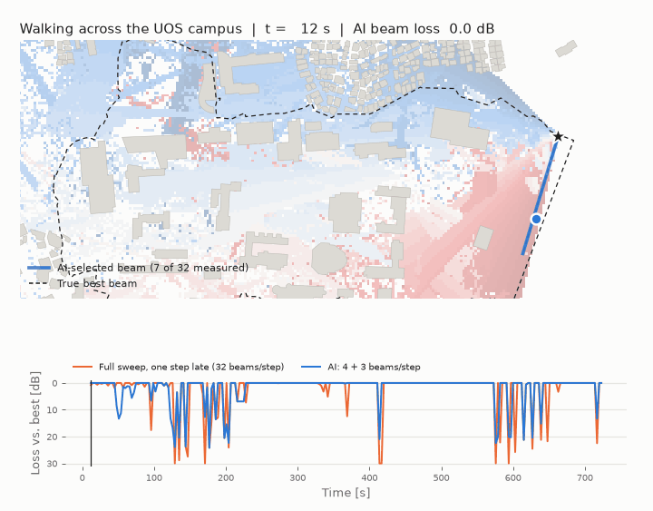

# UOS Beam Twin

**AI-driven beam management on a ray-tracing digital twin of the University of Seoul campus.**

This repository contains the code, data and paper of the final report
*AI-Driven Beam Management for 6G: A Survey with a Digital Twin Case Study*
(course *AI in Cellular Communication*, University of Seoul, Fall 2026).

The project builds a 3D radio digital twin of the UOS campus from OpenStreetMap with
[NVIDIA Sionna RT](https://github.com/NVlabs/sionna-rt). A 5G base station (gNB) with a 32-beam codebook
is placed on the highest campus rooftop. Neural networks are then trained to find the best beam
with far fewer measurements than the exhaustive beam sweep used today. Three cases are covered:
prediction from the user's position, prediction from a few measured beams (3GPP BM-Case 1), and
prediction for a user walking across campus (3GPP BM-Case 2). Everything runs at two carrier
frequencies, **3.5 GHz** (band n78, public 5G) and **4.7 GHz** (Korean private 5G, e-Um 5G), and on a
laptop: all results were produced on an Apple MacBook with an M5 chip.

<p align="center">
  
  <br><em>A user walks from the main gate to the Information and Technology Building. The glowing ground is the
  coverage of the beam chosen by the AI, and the lines are the strongest radio paths, recomputed every frame.</em>
</p>

---

## Contents

1. [Key results](#key-results)
2. [The problem in one minute](#the-problem-in-one-minute)
3. [Repository structure](#repository-structure)
4. [Installation](#installation)
5. [Quick start: reproduce the AI results in minutes](#quick-start-reproduce-the-ai-results-in-minutes)
6. [Full pipeline, step by step](#full-pipeline-step-by-step)
7. [Methodology](#methodology)
8. [Detailed results](#detailed-results)
9. [Interactive demo](#interactive-demo)
10. [The paper](#the-paper)
11. [Reproducibility notes](#reproducibility-notes)
12. [Troubleshooting](#troubleshooting)
13. [Limitations and future work](#limitations-and-future-work)
14. [Citation](#citation)
15. [Acknowledgements and licenses](#acknowledgements-and-licenses)

---

## Key results

All numbers are measured on **unseen areas of the campus** (spatial test split, see [Methodology](#methodology)).
"Loss" is the received power lost with respect to the best of the 32 beams found by an exhaustive sweep.

| | 3.5 GHz | 4.7 GHz |
|---|---:|---:|
| Locations where the best beam is **not** the one pointing at the user | 31.2 % | 31.9 % |
| Mean loss when simply pointing the beam at the user (geometric beam) | 6.05 dB | 6.25 dB |
| Position-only neural network: top-1 accuracy | 54.9 % | 57.4 % |
| Position-only neural network: loss when testing 4 of 32 beams | **1.03 dB** | 1.14 dB |
| Position + 4 measured beams (BM-Case 1): top-1 accuracy | **77.0 %** | 77.7 % |
| Position + 4 measured beams: loss with 8 beams measured in total | **0.12 dB** | 0.12 dB |
| Walking user, GRU (BM-Case 2), 7 beams per step | **1.25 dB** | 1.55 dB |
| Walking user, full 32-beam sweep applied one step late | 3.17 dB | 3.39 dB |

In plain words:

- Geometry alone is not enough. Buildings make the best beam point at a reflecting facade in about one third of
  the campus, and pointing at the user then loses 6 dB on average (up to 20 dB at the 90th percentile).
- Knowing only the user's position, the network stays below 1 dB of loss while testing just 4 of the 32 beams,
  which is 88 % less beam-sweep overhead.
- Adding 4 cheap measurements, the network reaches almost the performance of the full sweep (0.12 dB) with
  8 beams measured, i.e. 75 % fewer measurements.
- For a walking user, predicting the next beam with 7 measurements per step loses less than half as much as
  sweeping all 32 beams and applying the result one step late.
- The conclusions hold at both 3.5 and 4.7 GHz. At 4.7 GHz the signal is 2.5 dB weaker, matching the expected
  free-space difference 20·log10(4.7/3.5) = 2.56 dB, but the beam structure is set by the buildings and the array.

<p align="center">
  
  <br><em>(a) Steering angle of the best of 32 beams at each location. (b) Loss of the geometric beam. Dashed line: campus boundary; star: gNB.</em>
</p>

---

## The problem in one minute

Modern base stations use large antenna arrays that concentrate the signal in **narrow beams**. A narrow
beam gives a strong link, but it has to point at the right place. 5G New Radio finds it by **beam sweeping**:
the gNB transmits each beam of its codebook, the phone measures them all (L1-RSRP) and reports the best one.
The cost grows with the number of beams, and the sweep has to be repeated whenever the user moves or is blocked.

The best beam at a given location is mostly determined by the buildings around it. A model trained on
data from the site can therefore **predict** the best beam from cheap side information, and the network only
needs to **verify** a few candidates. 3GPP studied this in Release 18 (TR 38.843) and is specifying it in
Release 19:

- **BM-Case 1 (spatial):** the phone measures a small *Set B* of beams, and a model predicts the best beam of the
  full codebook *Set A*.
- **BM-Case 2 (temporal):** a model uses the history of Set B measurements to predict the best beam in the future.

Real measurements to train such models are expensive. A **digital twin** of the site, built with a ray tracer,
generates them cheaply. That is what this project does for the UOS campus.

---

## Repository structure

```
AI-BEAM-MANAGEMENT/
├── README.md                      this file
├── requirements.txt               Python dependencies
├── uos_twin.py                    shared helpers: scene loading, campus outline, buildings,
│                                  walkway graph, terrain grid, --freq option
├── 01_campus_scene.py             step 1  - 3D scene of the campus from OpenStreetMap + SRTM terrain
├── 02_campus_coverage.py          step 2  - gNB on the highest rooftop, coverage map
├── 03_beam_map.py                 step 3  - ray-traced power of all 32 beams on a 4 m grid (dataset)
├── 04_train_beam_predictor.py     step 4  - position-only prediction (MLP vs kNN vs geometry)
├── 05_beam_prediction_setB.py     step 5  - 3GPP BM-Case 1, prediction from a measured Set B
├── 06_walking_user.py             step 6  - 3GPP BM-Case 2, GRU for a walking user + 2D GIF
├── 07_walking_user_3d.py          step 7  - cinematic 3D video of the walk (Sionna RT render)
├── 08_compare_frequencies.py      step 8  - 3.5 GHz vs 4.7 GHz summary
├── 09_paper_figures.py            step 9  - IEEE-style figures for the paper (PDF + PNG)
├── 10_export_web_demo.py          step 10 - exports predictions for the interactive web demo
├── scenes/uos/                    Sionna RT scene (XML + PLY meshes + OSM extract + terrain)
├── data/                          ray-traced datasets (.npz) and walking routes
├── models/                        trained position-only networks (.pt)
├── results/                       metrics of every experiment (.json)
├── figures/                       all figures, GIFs and the 3D video
│   └── paper/                     the four paper figures (PDF for LaTeX, PNG 300 dpi)
├── paper/                         LaTeX source (IEEEtran), bibliography and compiled PDF
└── docs/                          interactive web demo (GitHub Pages)
```

`sionna-scene-baker/` (the SceneBaker library used to build the scene) is **not** part of this repository.
It is cloned separately during installation.

---

## Installation

Tested with Python 3.12 on macOS (Apple M5). The code also runs on Linux and Windows. Sionna RT uses the
GPU when available (Metal on Apple silicon, CUDA/OptiX on NVIDIA) and otherwise falls back to the LLVM CPU
backend. PyTorch uses MPS, CUDA or the CPU automatically.

### Option A: with `uv` (what was used for this project)

```bash
# 1. Install uv (https://docs.astral.sh/uv/) if you do not have it
curl -LsSf https://astral.sh/uv/install.sh | sh

# 2. Clone this repository
git clone https://github.com/mariamunoznadales2/AI-BEAM-MANAGEMENT.git
cd AI-BEAM-MANAGEMENT

# 3. Create and activate a virtual environment with Python 3.12
uv venv --python 3.12
source .venv/bin/activate          # Windows: .venv\Scripts\activate

# 4. Install the dependencies
uv pip install -r requirements.txt

# 5. Clone SceneBaker next to the scripts (needed by uos_twin.py and step 1)
git clone https://github.com/hslyu/sionna-scene-baker.git
```

### Option B: with plain `pip`

```bash
git clone https://github.com/mariamunoznadales2/AI-BEAM-MANAGEMENT.git
cd AI-BEAM-MANAGEMENT
python3.12 -m venv .venv
source .venv/bin/activate
pip install -r requirements.txt
git clone https://github.com/hslyu/sionna-scene-baker.git
```

### macOS notes

- On Apple silicon, the LLVM backend of Mitsuba needs `llvm`: `brew install llvm`.
  The Metal backend (`metal_ad_mono_polarized`) is used automatically when available.
- If you use VS Code, select the interpreter in `.venv` (`Cmd+Shift+P` → *Python: Select Interpreter*).
  The ▶ *Run* button runs scripts **without arguments** (i.e. at 3.5 GHz). Use the terminal for `--freq 4.7`.

### Check the installation

```bash
python -c "import sionna.rt, mitsuba as mi, torch; print('Sionna RT OK | Mitsuba', mi.__version__, '| torch', torch.__version__)"
```

---

## Quick start: reproduce the AI results in minutes

The ray-traced datasets for both frequencies are already in `data/`, so **no ray tracing is needed** to
reproduce the machine-learning results:

```bash
source .venv/bin/activate

# 3.5 GHz (default)
python 04_train_beam_predictor.py      # position-only prediction           -> results/metrics_3p5GHz.json
python 05_beam_prediction_setB.py      # BM-Case 1 (Set B of 4 and 8 beams) -> results/metrics_setB_3p5GHz.json
python 06_walking_user.py              # BM-Case 2 (walking user, GRU)      -> results/metrics_temporal_3p5GHz.json

# 4.7 GHz
python 04_train_beam_predictor.py --freq 4.7
python 05_beam_prediction_setB.py --freq 4.7
python 06_walking_user.py --freq 4.7

# Summary and paper figures
python 08_compare_frequencies.py       # -> results/frequency_comparison.json, figures/frequency_comparison.png
python 09_paper_figures.py             # -> figures/paper/fig1..fig4 (.pdf and .png)
```

Each training script takes a few minutes on a laptop. The scripts print the test metrics. The JSON files
committed in `results/` are the reference values reported in the paper. A new run overwrites them, so
compare before committing (see [Reproducibility notes](#reproducibility-notes)).

---

## Full pipeline, step by step

Every script is self-contained, documented at the top of the file, writes its outputs to `data/`,
`results/`, `models/` or `figures/`, and accepts `--freq <GHz>` (default 3.5). Run them from the repository
root with the environment active.

### Step 1: 3D digital twin of the campus (`01_campus_scene.py`)

```bash
python 01_campus_scene.py
```

- Area: latitude 37.5790–37.5885, longitude 127.0515–127.0655 (about 1.2 × 1.1 km). It covers the campus, the
  residential area to the north, the apartment blocks to the south-east and the foot of Mt. Baebong to the east.
- Downloads buildings, roads, footways and vegetation from **OpenStreetMap** (Overpass API) and **SRTM** terrain,
  and converts them into a Sionna RT scene with **SceneBaker**, without Blender. Buildings without a height tag
  get 15 m.
- If an Overpass server is overloaded (HTTP 504), the script automatically tries the next server in the list.
- Outputs: `scenes/uos/uos_scenebaker_terrain.xml` + meshes, `figures/campus_3d.png`, `figures/campus_top.png`.
- The scene used in the paper is already committed in `scenes/uos/`, so this step is optional.

### Step 2: base station and coverage (`02_campus_coverage.py`)

```bash
python 02_campus_coverage.py            # 3.5 GHz
python 02_campus_coverage.py --freq 4.7 # 4.7 GHz
```

- Searches the campus polygon (OSM way *University of Seoul*) on a 5 m grid for the **highest rooftop** and places
  the gNB **3 m above it**. It lands at (480, 118) m in local coordinates, about lat 37.5848 / lon 127.0639, with the
  antenna at 87.8 m above sea level.
- Computes a coverage map with `RadioMapSolver` on a **measurement surface that follows the terrain** at 1.5 m
  (handset height) rather than on a flat plane, which matters on a hilly campus.
- Ray tracing: 2·10⁷ rays, up to 5 interactions, diffraction enabled.
- Outputs: `figures/coverage_3d_<freq>.png`, `figures/coverage_top_<freq>.png`.

### Step 3: beam dataset (`03_beam_map.py`)

```bash
python 03_beam_map.py
python 03_beam_map.py --freq 4.7
```

- Antenna: **1 × 16 uniform linear array**, λ/2 spacing, 3GPP TR 38.901 element pattern, oriented towards the
  campus centroid.
- Codebook (Set A): **32 DFT beams** steered uniformly from −60° to +60°.
- For **every beam**, the received power is ray-traced (10⁷ rays, 5 interactions, diffraction) on a **4 × 4 m grid**
  following the terrain at 1.5 m. The beam weights are passed to `RadioMapSolver` as `precoding_vec`.
- Locations with path gain above −130 dB and inside the ±60° sector form the dataset: **~29,000 locations at 3.5 GHz**
  (28,587 at 4.7 GHz).
- Labels: best beam `best`, geometric beam `geo` (the beam closest to the direction of the user).
- Output `data/beams_uos_<freq>.npz` contains:

| key | shape | meaning |
|---|---|---|
| `x`, `y`, `z` | (246, 268) | cell centre in local coordinates [m] |
| `lat`, `lon` | (246, 268) | cell centre in WGS84 |
| `gains_db` | (32, 246, 268) | path gain of each beam [dB] |
| `best` | (246, 268) | index of the best beam |
| `geo` | (246, 268) | index of the geometric beam |
| `covered`, `in_sector` | (246, 268) | validity masks |
| `angles` | (32,) | steering angle of each beam [deg] |
| `tx_pos`, `tx_orientation` | (3,) | gNB position [m] and orientation [rad] |
| `cell` | () | cell size [m] |

- Figures: `figures/beam_map_<freq>.png`, `figures/geometric_beam_loss_<freq>.png`, `figures/beam_map_3d_<freq>.png`.
- This is the slowest step, because it ray-traces 32 maps. It is not needed for the quick start.

### Step 4: position-only prediction (`04_train_beam_predictor.py`)

- Input: user position (x, y, z). Output: one score per beam.
- Model: MLP with **Fourier features** `[p, sin(2^k π p), cos(2^k π p)]`, k = 0, 1, 2. It has 3 hidden layers of 256
  units (GELU), dropout 0.1 and AdamW (lr 2·10⁻³, weight decay 10⁻³, cosine schedule), and trains for 150 epochs
  with batch 1024. The checkpoint with the best validation loss is kept.
- Loss: cross-entropy with **soft labels**, softmax of the per-beam gains with a 2 dB temperature. Beams within a
  few dB of the best one are not punished as hard errors.
- Baselines: **geometric beam** (point at the user, then its angular neighbours) and **kNN** (average soft labels
  of the 5 nearest training positions).
- Evaluation: the phone tests the top-k ranked beams (k = 1…8) and keeps the strongest. The script reports top-1/top-3
  accuracy and the mean loss vs. k.
- Outputs: `models/beam_mlp_<freq>.pt`, `results/metrics_<freq>.json`, `figures/power_loss_vs_beams_<freq>.png`,
  `figures/prediction_vs_truth_<freq>.png`.

### Step 5: 3GPP BM-Case 1, measured Set B (`05_beam_prediction_setB.py`)

- Set B is a uniform subset of Set A: every 8th beam (**|B| = 4**) or every 4th beam (**|B| = 8**). No new ray tracing
  is needed.
- Every Set B measurement gets a **1 dB Gaussian error**; values below −140 dB are clipped to the floor.
- Measurement features: absolute level `(m + 100)/20` and shape relative to the strongest measured beam `(m − max)/10`.
- Methods, all compared at the **same total number of beams measured** (|Set B| + extra predicted beams):
  - geometric beam
  - position NN (step 4)
  - Set B strongest, no AI (strongest measured beam, then its neighbours)
  - Set B NN (network fed with the measurements)
  - position + Set B NN
- Outputs: `results/metrics_setB_<freq>.json`, `figures/power_loss_vs_overhead_<freq>.png`.

### Step 6: 3GPP BM-Case 2, walking user (`06_walking_user.py`)

- **Part A, temporal prediction.**
  - The user walks on the 4 m grid (one step ≈ 3 s at 1.4 m/s) and measures the 4 Set B beams at every step.
  - A **2-layer GRU** (128 units) reads the last 4 steps (positions + Set B measurements) and predicts the best beam
    at the **next** step.
  - Training walks (24 steps each) stay inside training blocks, and test walks inside test blocks.
  - Compared with a full 32-beam sweep whose result is applied one step late, and with a snapshot network that sees
    only the current step.
  - The AI schemes measure 4 beams per step (top-1) or 4 + 3 = **7 beams per step** (top-3).
- **Part B, real campus routes** on the OSM walkway graph:
  1. the **longest route** inside the campus (988 m), shown in the 2D GIF `figures/walking_user_<freq>.gif`
     and in `figures/walking_user_power_<freq>.png`;
  2. **main gate → Information and Technology Building** (579 m), saved to `data/route_gate_to_it_<freq>.npz`
     for the 3D video.
- Output: `results/metrics_temporal_<freq>.json`.

### Step 7: cinematic 3D video (`07_walking_user_3d.py`)

```bash
python 07_walking_user_3d.py --preview   # 640×360, quick test
python 07_walking_user_3d.py             # 1280×720, 64 samples per pixel, 366 frames
```

- Dark "tech" rendering of the campus with Sionna RT. The ground glows with the coverage of the beam currently
  chosen by the AI.
- The 6 strongest radio paths to the user are recomputed every frame with `PathSolver` (white: line of sight,
  pink: reflection, amber: diffraction).
- A blocky character, scaled 6× so it is visible, walks the gate → IT Building route.
- Camera: establishing orbit → fly-in → chase camera. A HUD drawn with Pillow shows live statistics and a minimap.
- Robustness: frames already rendered are reused, so an interrupted run resumes where it stopped. Failed frames
  are retried, and the process restarts itself if the Metal GPU state gets corrupted.
- Outputs: `figures/walking_user_3d_<freq>.mp4`, a small GIF and the frames in `figures/walking_user_3d_frames_<freq>/`.
  The frames folders are excluded from git because they take hundreds of MB.
- Needs `imageio-ffmpeg` for the MP4 (included in `requirements.txt`).

### Step 8: frequency comparison (`08_compare_frequencies.py`)

Reads the results of steps 3–6 for both bands, then prints and saves a summary table
(`results/frequency_comparison.json`) and a figure (`figures/frequency_comparison.png`).
Run steps 2–6 with `--freq 4.7` first.

### Step 9: paper figures (`09_paper_figures.py`)

Rebuilds the four figures of the paper from the saved results, with no ray tracing and no training. They are
sized for IEEE Transactions (3.5 in single column, 7.16 in double column), use 8-pt serif text and a
colour-blind-safe palette, and add markers and dashes so they also read in grayscale. Each figure is saved as
vector PDF (for LaTeX) and 300 dpi PNG (for slides) in `figures/paper/`.

### Step 10: web demo export (`10_export_web_demo.py`)

Retrains the position-only and position + Set B (|B| = 4) networks with the same split and settings. It then
stores, for every campus cell, the 32 gains, the best and geometric beams, the train/val/test split and the
top-8 ranking of both networks, in `web/demo_data_<freq>.json`. These files feed the [interactive demo](#interactive-demo).

---

## Methodology

### Coordinate system and scene

All positions are in a local East-North frame (metres) centred on the scene area and computed with SceneBaker's
`LocalProjection`. Heights are metres above sea level. The gNB is at (479.6, 118.3, 87.8) m.

### Train / validation / test split

A random split would put neighbouring 4 m cells in both training and test sets. Because the beam map is smooth
at that scale, it would overestimate accuracy. Instead, the campus is divided into **40 × 40 m blocks**, and
70 / 15 / 15 % of the blocks are used for training, validation and testing (seed 0). Every reported number
therefore measures performance in **areas the model has never seen**. Steps 4, 5, 6 and 10 use exactly the same split.

### Metrics

For a location with per-beam gains g₁…g₃₂, best beam k\* and the beam actually used k̂:

- **Top-K accuracy:** probability that k\* is among the K beams ranked first.
- **Power loss:** g_{k\*} − g_{k̂} in dB, averaged over test locations. When the phone tests several candidates,
  k̂ is the strongest of them.
- **Overhead reduction:** 1 − (beams measured) / 32.

### Why soft labels and Fourier features

Several beams are often within 1–2 dB of the best one, so a hard one-hot label punishes good choices. Soft labels
(softmax of gains / 2 dB) teach the network a ranking instead. Fourier features let a small MLP represent the
**sharp boundaries** that buildings create in the beam map. A plain MLP on (x, y, z) is too smooth
(Tancik et al., NeurIPS 2020).

---

## Detailed results

### Position-only prediction (step 4), mean loss vs. beams tested, 3.5 GHz

| beams tested (k) | 1 | 2 | 3 | 4 | 5 | 6 | 7 | 8 |
|---|---:|---:|---:|---:|---:|---:|---:|---:|
| Neural network | 4.25 | 2.47 | 1.53 | **1.03** | 0.77 | 0.48 | 0.31 | **0.22** |
| kNN (k = 5) | 4.51 | 2.51 | 1.48 | 1.05 | 0.84 | 0.72 | 0.60 | 0.49 |
| Geometric beam | 6.14 | 4.46 | 3.44 | 2.85 | 2.32 | 1.99 | 1.56 | 1.41 |

Top-1 / top-3 accuracy: neural network 54.9 % / 82.2 %, kNN 56.9 % / 82.4 %, geometric 47.6 % / 67.7 %.
Like Morais et al. (ICC 2023) on real data, the network and kNN have similar top-1 accuracy, but the network
ranks the candidates better, so it wins as soon as more than one beam is tested.

### BM-Case 1 (step 5), top-1 accuracy

| Method | 3.5 GHz | 4.7 GHz |
|---|---:|---:|
| Geometric beam | 47.6 % | 47.2 % |
| Position NN | 54.9 % | 57.4 % |
| Strongest of 4 measured beams (no AI) | 8.2 % | 6.8 % |
| Set B NN, 4 beams | 71.6 % | 72.1 % |
| Position + Set B NN, 4 beams | **77.0 %** | **77.7 %** |
| Strongest of 8 measured beams (no AI) | 24.1 % | 26.0 % |
| Set B NN, 8 beams | 87.6 % | 88.3 % |
| Position + Set B NN, 8 beams | **88.0 %** | **88.5 %** |

### BM-Case 1, mean loss vs. total beams measured, 3.5 GHz

| total beams measured | 4 | 5 | 6 | 7 | 8 | 10 | 12 |
|---|---:|---:|---:|---:|---:|---:|---:|
| Strongest of Set B(4), no AI | 10.62 | 10.62 | 9.30 | 7.36 | 5.80 | 3.67 | 1.46 |
| Set B NN, \|B\| = 4 | 10.62 | 1.56 | 0.92 | 0.50 | 0.32 | 0.17 | 0.09 |
| Position + Set B NN, \|B\| = 4 | 10.62 | **0.84** | 0.43 | 0.21 | **0.12** | 0.04 | 0.02 |
| Position NN (no Set B) | 1.03 | 0.77 | 0.48 | 0.31 | 0.22 | 0.12 | 0.07 |

With narrow beams, measuring 4 of them without AI is almost useless (10.6 dB loss), because the best beam
usually falls between the measured ones. A network interprets the same 4 measurements and loses 0.84 dB with a
single extra beam. At very low overhead (5 beams), position alone is as good as position plus 4 measurements:
the position from the digital twin is worth roughly four beam measurements.

### BM-Case 2, walking user (step 6)

| Scheme | beams per step | loss 3.5 GHz | loss 4.7 GHz |
|---|---:|---:|---:|
| Full sweep, applied one step late | 32 | 3.17 dB | 3.39 dB |
| Snapshot NN (current step only), top-3 | 7 | 1.29 dB | 1.73 dB |
| **GRU (last 4 steps), top-3** | **7** | **1.25 dB** | **1.55 dB** |

### Frequency comparison (step 8)

| | 3.5 GHz | 4.7 GHz |
|---|---:|---:|
| Coverage (path gain > −130 dB) | 55.8 % | 54.8 % |
| Mean path gain of the best beam | −92.7 dB | −95.2 dB |
| kNN top-1 | 56.9 % | 57.7 % |

<p align="center">
  
</p>
<p align="center">
  
  
</p>

<p align="center">
  
  <br><em>2D view of the longest campus route (988 m): true best beam, AI beam and received power over time.</em>
</p>

---

## Interactive demo

`docs/index.html` is a self-contained web page where you can:

- click any point of the campus and see the power of the 32 beams there, the best beam, the geometric beam and
  the beams the AI asks the phone to measure;
- switch between 3.5 and 4.7 GHz, between position-only and position + 4 measured beams, and choose how many
  predicted beams are tested;
- colour the map by best beam, AI loss, geometric loss or train/test split;
- play the walk from the main gate to the IT Building and watch the 3D video.

**Publish it with GitHub Pages:** *Settings → Pages → Build and deployment → Deploy from a branch →
`main` / `/docs` → Save*. After a minute the demo is live at `https://mariamunoznadales2.github.io/AI-BEAM-MANAGEMENT/`.
It can also be opened locally by double-clicking `docs/index.html` (an internet connection is needed only for
the web fonts).

The numbers in the demo come from networks retrained by `10_export_web_demo.py` with the same split and
settings. They can differ from the paper by a few percentage points because of the random measurement noise
and GPU non-determinism.

---

## The paper

`paper/` contains the final report (IEEE Transactions format, 5 pages):

- `Final_Report_AI_Beam_Management.pdf`: compiled report
- `main.tex`: LaTeX source (IEEEtran journal class)
- `references.bib`: 22 references (3GPP TR 38.843, Rel-19, surveys, position-aided, sensing-aided and temporal
  beam prediction, digital twins, Sionna RT, SceneBaker…)

Compile:

```bash
cd paper
pdflatex main && bibtex main && pdflatex main && pdflatex main
```

The figures are taken from `../figures/paper/` (`\graphicspath`).

Outline: I. Introduction · II. Beam management fundamentals · III. AI techniques (position-aided, partial
measurements / BM-Case 1, sensing-aided, temporal / BM-Case 2, data and digital twins) · IV. Standardization
in 3GPP · V. Case study: a digital twin of the University of Seoul · VI. Open challenges · VII. Conclusion.

---

## Reproducibility notes

- **Seeds:** all splits, noise draws and network initialisations use seed 0.
- **Small run-to-run differences:** training on the Apple GPU (MPS) or with CUDA is not bit-exact. Expect
  differences of about one percentage point in accuracy and a few hundredths of a dB in loss. For example,
  re-running step 4 on a CPU gives 55.3 % top-1 instead of the 54.9 % reported.
- **Ray tracing is stochastic:** Sionna RT shoots random rays, so re-running step 3 gives slightly different gains.
  The datasets used in the paper are committed in `data/`.
- **Reference results:** the JSON files in `results/` are the values in the paper. Re-running a script overwrites
  them. Use `git diff results/` to compare, and `git checkout results/` to restore.
- **Frequency tag:** every output file carries the band in its name (`_3p5GHz`, `_4p7GHz`), so both bands coexist.

---

## Troubleshooting

| Symptom | Cause / fix |
|---|---|
| `ModuleNotFoundError: scenebaker` or `src.projection` | SceneBaker is not cloned next to the scripts: `git clone https://github.com/hslyu/sionna-scene-baker.git` |
| Step 1 fails with HTTP 504 / 429 | Overpass API overloaded. The script already tries several servers; wait a few minutes and retry. |
| Everything runs at 3.5 GHz even with `--freq 4.7` | You used the VS Code ▶ button, which passes no arguments. Run from the terminal. |
| Step 7: `jit_var_scatter` error, black frames or a camera error | Transient Metal GPU errors. The script retries, reuses the previous frame if needed and restarts itself. Run it again and it resumes from the last frame. |
| Step 7: no MP4, only frames | Install `imageio-ffmpeg`: `pip install imageio-ffmpeg` |
| Pylance/Pyright warnings on Mitsuba types | Expected with Dr.Jit types. Use the interpreter in `.venv`, and add `sionna-scene-baker` to `extraPaths` in `pyrightconfig.json`. |
| Ray tracing is very slow | Mitsuba is running on the CPU (LLVM) backend. Check `python -c "import mitsuba as mi; print(mi.variants())"`: a `metal_*` (Apple silicon) or `cuda_*` (NVIDIA) variant should be listed. |

---

## Limitations and future work

- **Building heights and materials:** OSM often has no height tag (15 m is assumed), and materials are generic
  (concrete, glass, ground). The twin has **not been calibrated with real measurements**.
- **Static scene:** there are no people, vehicles or foliage dynamics, so the accuracy is an upper bound for a real deployment.
- **Single site and single array:** generalization to other gNB positions, arrays and campuses is not tested, and
  it is the main open problem identified by 3GPP.
- **2D codebook:** the array is horizontal (azimuth only). A planar array would add elevation beams.

Natural next steps: calibrate the twin with drive-test measurements (Sionna RT is differentiable), test other gNB
sites and arrays, add vertical beams, and validate on a real private 5G network at 4.7 GHz.

---

## Citation

```bibtex
@techreport{munoz2026uosbeamtwin,
  author      = {Mar{\'i}a Mu{\~n}oz},
  title       = {{AI}-Driven Beam Management for {6G}: A Survey with a Digital Twin Case Study},
  institution = {University of Seoul},
  type        = {Final report, AI in Cellular Communication},
  year        = {2026}
}
```

---

## Acknowledgements and licenses

- [Sionna RT](https://github.com/NVlabs/sionna-rt) by NVIDIA (Apache 2.0): differentiable ray tracing.
- [SceneBaker](https://github.com/hslyu/sionna-scene-baker) by H. Lyu et al. (MIT): OpenStreetMap to Sionna scenes.
- Map data © [OpenStreetMap contributors](https://www.openstreetmap.org/copyright), available under the ODbL.
  The scene in `scenes/uos/` is derived from it.
- SRTM terrain data: NASA / USGS.
- [PyTorch](https://pytorch.org), NumPy, SciPy, Shapely, Matplotlib, Pillow, imageio.

Author: **María Muñoz**, University of Seoul. Course *AI in Cellular Communication*, Fall 2026.
